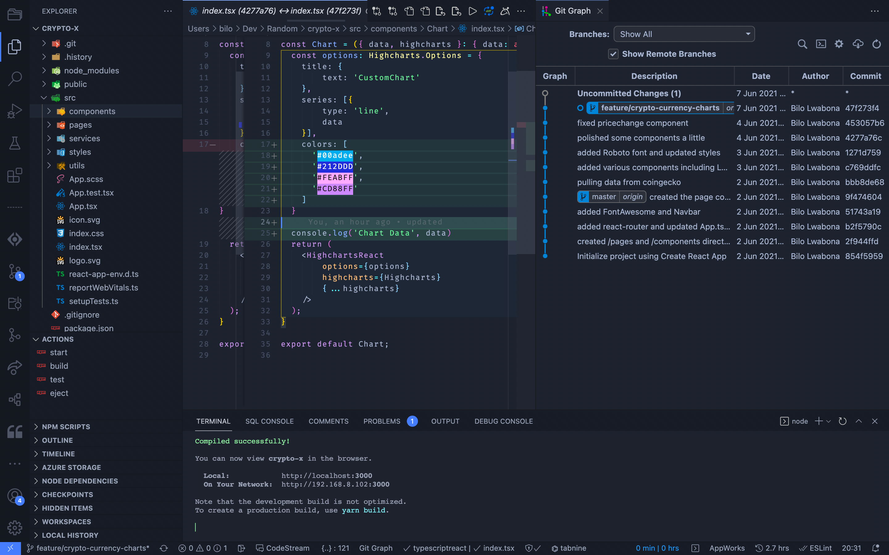
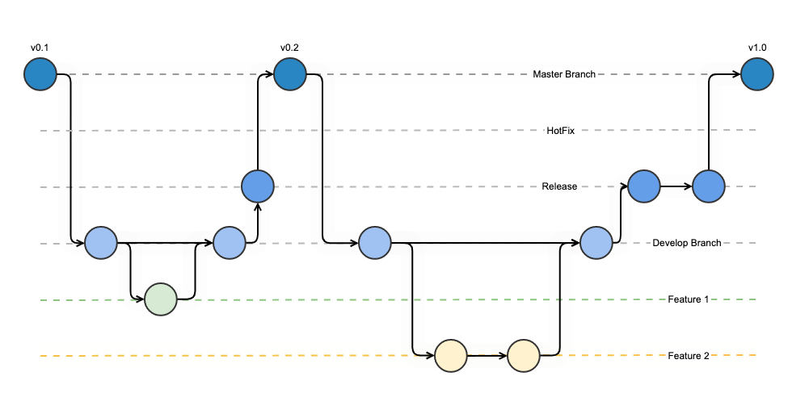

# 1. Environment

> A guide to frontend development with Visual Studio Code.
>
> - Back to the [README](../../README.md)
> - Check out the [Guides](./guides/CryptoCharts.md)
> - Also check out [Appendices](./appendix/CodingStandards.md)

- `1. Environment`
- [2. ES6, Typescript & NodeJS](./2-Javascript.md)
- [3. React](./3-React.md)
- [4. Redux](./4-Redux.md)
- [5. Styling](./5-Styling.md)
- [6. Storybook](./6-Storybook.md)
- [7. Testing](./7-Testing.md)
- [8. Git](./8-Git.md)
- [9. Webpack](./9-Webpack.md)
- [10. Development](./10-Development.md)

## Editor

There are various aspects to a development environment. First and foremost, your workstation... your Editor.
If you have not installed a preferred editor yet, download [Visual Studio Code](https://code.visualstudio.com/download), as it is strongly recommended and the assumed editor throughout this guide.

> NOTE: Here is a list of some [popular alternatives](https://hackr.io/blog/web-development-ide)

### Recommended Plugins

#### General

- [VSCode Essentials](https://marketplace.visualstudio.com/items?itemName=jabacchetta.vscode-essentials)
- [Node Essentials](https://marketplace.visualstudio.com/items?itemName=afractal.node-essentials)
- [Tabnine Autocomplete AI](https://marketplace.visualstudio.com/items?itemName=TabNine.tabnine-vscode)
- [color-highlight](https://marketplace.visualstudio.com/items?itemName=naumovs.color-highlight)
- [Settings Sync](https://marketplace.visualstudio.com/items?itemName=Shan.code-settings-sync)

#### Git

[Git](https://www.atlassian.com/git/tutorials/why-git) is used to manage and collaborate on the source code, (or any folder really).
> More on this in the [Git Chapter](./8-Git.md)

- [Git Lens](https://marketplace.visualstudio.com/items?itemName=eamodio.gitlens)
- [Git Graph](https://marketplace.visualstudio.com/items?itemName=mhutchie.git-graph)
- [Git Flow](https://marketplace.visualstudio.com/items?itemName=PsykoSoldi3r.vscode-git-flow)

## Env

- [Install Homebrew](https://brew.sh/)
- [Install NodeJS](https://nodejs.org/en/)

> NOTE: For `Mac OS` users ideally install and manage Node via [Homebrew](https://brew.sh/):
>
> - `brew update`
> - `brew install node`
> - `node -v`
> - `npm -v`

- Install [yarn](https://yarnpkg.com/):

> - `npm install -g yarn`
> - `yarn -v`

Depending on the project you will either use `npm` or `yarn` as the package manager.

> - NPM: locate a `package-lock.json` file in the project root.
> - YARN: locate a `yarn.lock` file in the project root.
> Reference: [Yarn vs NPM](https://www.whitesourcesoftware.com/free-developer-tools/blog/npm-vs-yarn-which-should-you-choose/#:~:text=As%20you%20can%20see%20above,each%20one%20at%20a%20time.&text=While%20npm%20also%20supports%20the,Yarn%27s%20is%20far%20much%20better.)

## Workflow

If you are working in a team, it will be beneficial to use a software development methodology to manage your workflow.

### [Scrum / Sprints](https://www.atlassian.com/agile/scrum/sprints)

Scrum is a software development methodology, an organized process for a development team to build a system.

Other, more common moethodologies include [Waterfall, Agile, Extreme Programming, Lean & Kan Ban](https://www.upwork.com/resources/most-common-software-development-methodologies?utm_source=google&utm_campaign=SEM_GGL_INTL_NonBrand_Marketplace_DSA&utm_medium=cpc&utm_content=113089129402&utm_term=&campaignid=11384804789&matchtype=b&device=c&gclid=CjwKCAjwn6GGBhADEiwAruUcKtkBsWWpJAKhhLHEEvIyQNKTI9YHydPaJCFGa7h-RwhwrT-As7zfbxoCdaEQAvD_BwE)

_"Sprints make projects more manageable, allow teams to ship high-quality work faster and more frequently, and gives them more flexibility to adapt to change."_

- Sprints often run in cycles of 1-4 weeks... typically 2 weeks.
- There is standup every morning where you talk about
  - what you **accomplished** the previous day
  - what you **plan** to do on the current day
  - any **blockers** you are experiencing
- Every sprint you will have the following meetings once each:
  - **Planning**: The tasks for the following sprint are planned and their effort is estimated
  - **Review**: Anything you can show from the sprint
  - **Retro**: How you felt about what was that sprint (pros, cons, areas of improvement)

### [Jira](https://www.atlassian.com/software/jira)

_"Jira Software is built for every member of your software team to plan,
track, and release great software."_

Things to know about:

- [What is a user story](https://www.linkedin.com/pulse/what-user-story-dave-todaro/)
- [Estimating Tasks](https://www.productplan.com/glossary/fibonacci-agile-estimation/)

> We use Jira to track all programming related tasks

[Git Flow](https://www.atlassian.com/git/tutorials/comparing-workflows/gitflow-workflow)

Git flow Workflow is a Git workflow that helps with continuous software development and implementing DevOps practices. This workflow defines a strict branching model designed around the project release. This provides a robust framework for managing larger projects.

 
 

 
 

[Next Part: 2. ES6, Typescript & NodeJS](./2-Javascript.md)

 
 