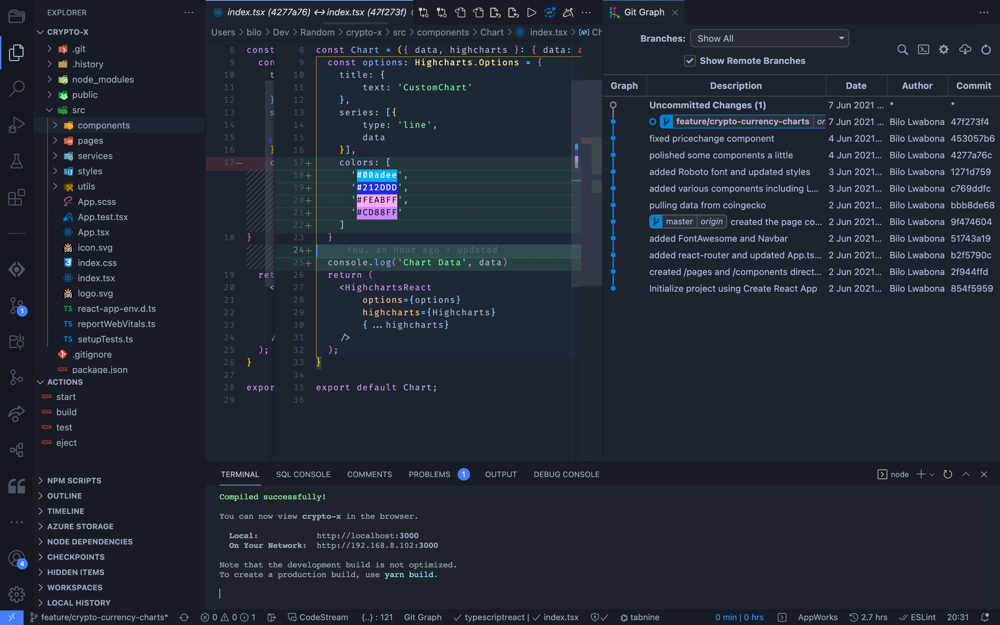

# 1. Setup Environment

> A guide to frontend development with Visual Studio Code.
>
> - Back to the [README](../../README.md)
> - Try out the [Assessment](./guides/CryptoCharts.md)
> - Also check out [Appendices](./appendix/CodingStandards.md)

- Setup Environment
- [2. ES6, Typescript & NodeJS](./2-Javascript.md)
- [3. React](./3-React.md)
- [4. Redux](./4-Redux.md)
- [5. Styling](./5-Styling.md)
- [6. Storybook](./6-Storybook.md)

## Editor

If you have not installed a preferred editor yet, download [Visual Studio Code](https://code.visualstudio.com/download), as it is strongly recommended and the assumed editor throughout this guide.

### Recommended Plugins

#### General

- [VSCode Essentials](https://marketplace.visualstudio.com/items?itemName=jabacchetta.vscode-essentials)
- [Node Essentials](https://marketplace.visualstudio.com/items?itemName=afractal.node-essentials)
- [Tabnine Autocomplete AI](https://marketplace.visualstudio.com/items?itemName=TabNine.tabnine-vscode)
- [color-highlight](https://marketplace.visualstudio.com/items?itemName=naumovs.color-highlight)
- [Settings Sync](https://marketplace.visualstudio.com/items?itemName=Shan.code-settings-sync)

#### Git

- [Git Lens](https://marketplace.visualstudio.com/items?itemName=eamodio.gitlens)
- [Git Graph](https://marketplace.visualstudio.com/items?itemName=mhutchie.git-graph)
- [Git Flow](https://marketplace.visualstudio.com/items?itemName=PsykoSoldi3r.vscode-git-flow)

## Env

- [Install Homebrew](https://brew.sh/)
- [Install NodeJS](https://nodejs.org/en/)

> NOTE: For `Mac OS` users ideally install and manage Node via [Homebrew](https://brew.sh/):
>
> - `brew update`
> - `brew install node`
> - `node -v`
> - `npm -v`

- Install [yarn](https://yarnpkg.com/):

> - `npm install -g yarn`
> - `yarn -v`

Depending on the project you will either use `npm` or `yarn` as the package manager.

> - NPM: locate a `package-lock.json` file in the project root.
> - YARN: locate a `yarn.lock` file in the project root.
> Reference: [Yarn vs NPM](https://www.whitesourcesoftware.com/free-developer-tools/blog/npm-vs-yarn-which-should-you-choose/#:~:text=As%20you%20can%20see%20above,each%20one%20at%20a%20time.&text=While%20npm%20also%20supports%20the,Yarn%27s%20is%20far%20much%20better.)

## Workflow

- [Jira](https://www.atlassian.com/software/jira)

_"Jira Software is built for every member of your software team to plan,
track, and release great software."_

> We use Jira to track all programming related tasks

- [Git Flow](https://www.atlassian.com/git/tutorials/comparing-workflows/gitflow-workflow)

Git flow Workflow is a Git workflow that helps with continuous software development and implementing DevOps practices. This workflow defines a strict branching model designed around the project release. This provides a robust framework for managing larger projects.

