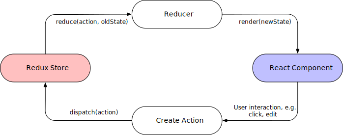

# Redux

A guide to frontend development with Visual Studio Code.

- [1. Setup Environment](./1-SetupEnvironment.md)
- [2. ES6, Typescript & NodeJS](./2-Javascript.md)
- [3. React](./3-React.md)
- 4. Redux
- [5. Styling](./5-Styling.md)
- [6. Storybook](./6-Storybook.md)

## Overview

Redux is a predictable state container for JavaScript apps.

It helps you write applications that behave consistently, run in different environments (client, server, and native), and are easy to test. On top of that, it provides a great developer experience, such as live code editing combined with a time traveling debugger.

You can use Redux together with React, or with any other view library. It is tiny (2kB, including dependencies), but has a large ecosystem of addons available.

## Integration With React

- Provider (store)
- Reducers
- Actions

## Redux DevTools

[Download Redux DevTools Extension](https://chrome.google.com/webstore/detail/redux-devtools/lmhkpmbekcpmknklioeibfkpmmfibljd?hl=en) for your browser
- 

## Redux Toolkit

- Motivation
- Code Sample
