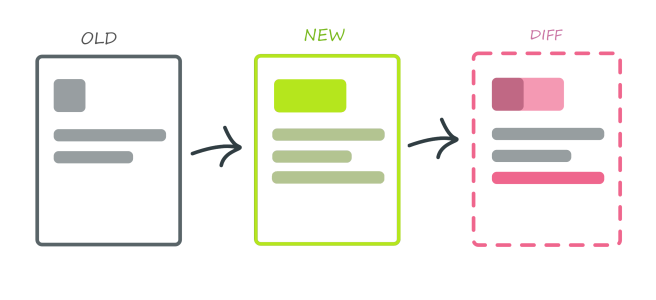

# 7. Testing

> A guide to frontend development with Visual Studio Code.
>
> - Back to the [README](../../README.md)
> - Check out the [Guides](./guides/CryptoCharts.md)
> - Also check out [Appendices](./appendix/CodingStandards.md)

- [1. Environment](./1-Environment.md)
- [2. ES6, Typescript & NodeJS](./2-Javascript.md)
- [3. React](./3-React.md)
- [4. Redux](./4-Redux.md)
- [5. Styling](./5-Styling.md)
- [6. Storybook](./6-Storybook.md)
- `7. Testing`
- [8. Git](./8-Git.md)
- [9. Webpack](./9-Webpack.md)
- [10. Development](./10-Development.md)

## Unit Tests

**Unit Testing** is a type of software testing where individual units or components of a software are tested. The purpose is to validate that each unit of the software code performs as expected. Unit Testing is done during the development (coding phase) of an application by the developers.

### Jest

[Jest](https://jestjs.io/) is a unit testing library, which can be used to test individual bits of functionality in isolation.

## E2E Tests

E2E (end-to-end) tests help verify high-value paths in your application. In other words, they help verify user stories as they often represent flows in your application.

> NOTE:
> Sometimes associated/confused with `e2e` tests, `Integration` tests help verify the integration of multiple functions or components.

### Cypress

[Cypress](https://www.cypress.io/) is a next generation front end testing tool built for the modern web. It addresses the key pain points developers and QA engineers face when testing.

## Visual Regression Testing

[Visual Regression Testing](https://medium.com/loftbr/visual-regression-testing-eb74050f3366)

There are [many tools](https://github.com/mojoaxel/awesome-regression-testing) that accomplish this to some degree.
### Storybook for Testing
Storybook can be used for various different kinds of testing, using addons.

- Visual regression

- Accessibility

 
 

 
 

[Next Part: 8. Git](./8-Git.md)

 
 