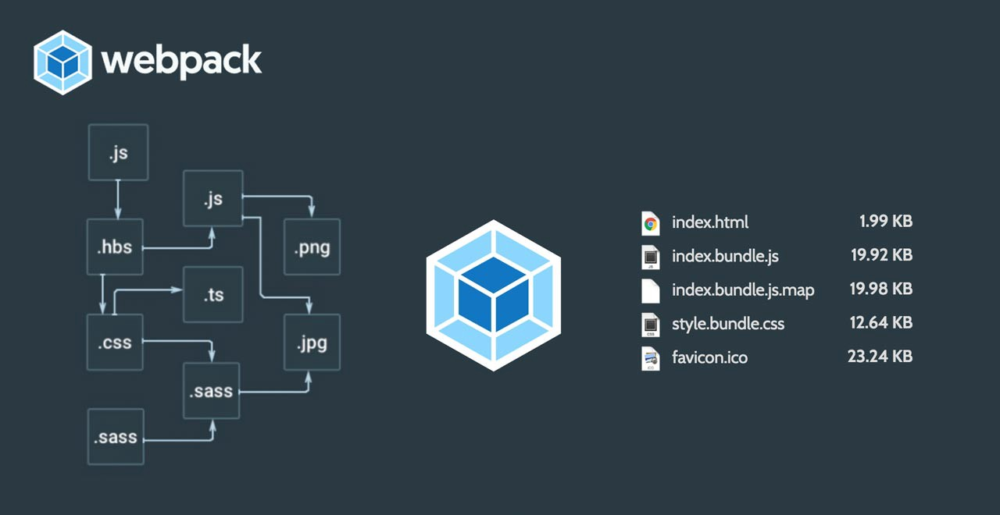

# 9. Webpack

> A guide to frontend development with Visual Studio Code.
>
> - Back to the [README](../../README.md)
> - Check out the [Guides](./guides/CryptoCharts.md)
> - Also check out [Appendices](./appendix/CodingStandards.md)

- [1. Environment](./1-Environment.md)
- [2. ES6, Typescript & NodeJS](./2-Javascript.md)
- [3. React](./3-React.md)
- [4. Redux](./4-Redux.md)
- [5. Styling](./5-Styling.md)
- [6. Storybook](./6-Storybook.md)
- [7. Testing](./7-Testing.md)
- [8. Git](./8-Git.md)
- `9. Webpack`
- [10. Development](./10-Development.md)

## Overview

> `webpack 5` runs on **Node.js** version `10.13.0+`.

At its core, [Webpack](https://webpack.js.org/concepts/) is a static module bundler for modern JavaScript applications. When webpack processes your application, it internally builds a dependency graph which maps every module your project needs and generates one or more bundles.



## Core Concepts

Sample webpack config:
```js
const HtmlWebpackPlugin = require('html-webpack-plugin'); //installed via npm
const webpack = require('webpack'); //to access built-in plugins
const path = require('path');

module.exports = {
  entry: './src/index.js',
  output: {
    path: path.resolve(__dirname, 'dist'),
    filename: 'bundle.js',
  },
  module: {
    rules: [{ test: /\.txt$/, use: 'raw-loader' }],
  },
  plugins: [new HtmlWebpackPlugin({ template: './src/index.html' })],
  mode: 'production',
};
```

### Entry

An entry point indicates which module Webpack should use to begin building out its internal dependency graph. Webpack will figure out which other modules and libraries that entry point depends on (directly and indirectly).

### Output

The output property tells Webpack where to emit the bundles it creates and how to name these files. It defaults to ./dist/main.js for the main output file and to the ./dist folder for any other generated file.

### Loaders

Out of the box, Webpack only understands JavaScript and JSON files. Loaders allow Webpack to process other types of files and convert them into valid modules that can be consumed by your application and added to the dependency graph.

### Plugins

While loaders are used to transform certain types of modules, plugins can be leveraged to perform a wider range of tasks like bundle optimization, asset management and injection of environment variables.

### Mode

By setting the mode parameter to either development, production or none, you can enable Webpack's built-in optimizations that correspond to each environment. The default value is production.

### Browser Compatibility

Webpack supports all browsers that are ES5-compliant (IE8 and below are not supported). Webpack needs Promise for import() and require.ensure(). If you want to support older browsers, you will need to load a polyfill before using these expressions.

<br />
<br />
<br />
<br />
<br />

[Next Part: 10. Development](./10-Development.md)

<br />
<br />