# Onboarding Exercise

> A guide to frontend development with Visual Studio Code.
>
> - Back to the [README](../../../README.md)
> - Also check out [Appendices](../appendix/CodingStandards.md)

## Crypto Charts

The purpose of this guide is to get a basic understanding of how our technologies work and fit together. To try and structure your learning you will be creating an app similar to this one:


At the end of this exercise you will have covered:

- React
- React Router
- Redux
- Tailwind CSS
- API communication with `axios`

## Task Description

Create a React application using [Create React App (CRA)](https://reactjs.org/docs/create-a-new-react-app.html#create-react-app). The app should:

- fetch crypto currency data from the CoinGecko API.
- show a list / grid view of the list of currencies
- allow toggling between list and grid view
- clicking on a crypto currency in your UI should navigate to a new, "detail" page (e.g. `/explore/:cryptoCurrency`), on which you should
  - show more data about the selected crypto currency
  - be able to see a chart of the crypto currency's performance using the React wrapper of [Highcharts](https://www.highcharts.com/demo), namely [highcharts-react-official](https://www.npmjs.com/package/highcharts-react-official).
  - BONUS: Add the ability to overlay other crypto currencies on the same chart
    - HINT: Ideally use redux to persist the pages
- Implement `TailwindCSS` for styling and `FontAwesome` for icons

Create a Navbar which:

- has the items:
  - `/` for home
  - `/explore` for the page to explore crypto currencies
  - `/favorites` to see which crypto currencies you saved to your localStorage
- is a sidebar (for desktop and tablet screen sizes)
- is a bottom tab bar (for mobile screen sizes)

## Resources

- [Create React App](https://reactjs.org/docs/create-a-new-react-app.html#create-react-app)

> A comfortable environment for learning React, and is the best way to start building a new single-page application in React.

- [Tailwind CSS](https://tailwindcss.com/)

> A utility-first CSS framework packed with classes like flex, pt-4, text-center and rotate-90 that can be composed to build any design, directly in your markup.

- [CoinGecko Dashboard](https://www.coingecko.com/en)
- [CoinGecko API](https://www.coingecko.com/api/documentations/v3)

> Get crypto currency prices, market overview, and analysis such as crypto market cap, trading volume, and more.

- [Highcharts React](https://www.npmjs.com/package/highcharts-react-official)

> A library for charting written in pure JavaScript, first released in 2009.

## Guide

## Step 1: Initialize project

Initialize the project with the terminal command:
> NOTE: we are using [TypeScript](https://www.typescriptlang.org/) as the preferred language

```sh
npx create-react-app my-app --template typescript
```

> Once initialized, you should see the following:
>
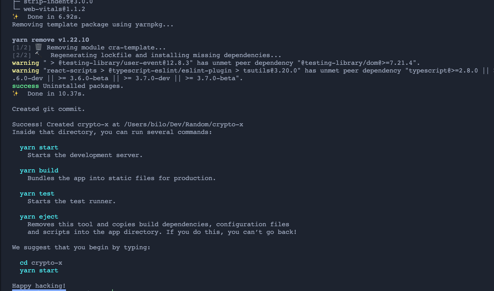

> Running `yarn start` should spin app the app in your default browser looking something like:
>
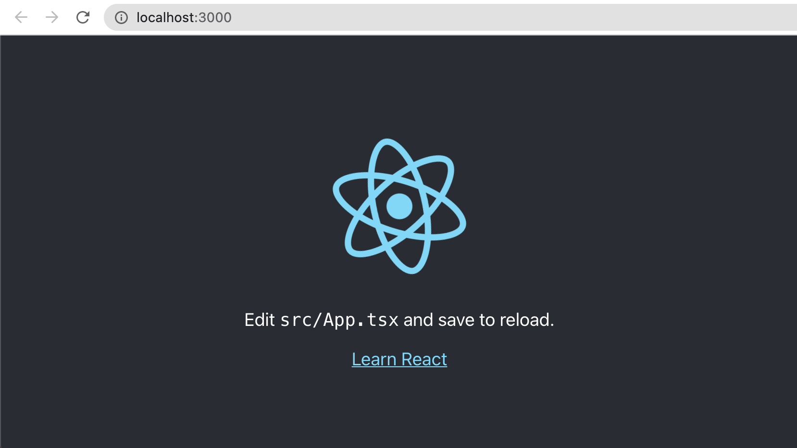

>NOTE:
>
> - All commands such as `yarn start` can be found in `package.json` under the `scripts` node.
> - DO NOT `eject` unless you know what you are doing

## Step 2: Create project structure

Create a `src/pages` directory to keep all the different pages your webapp renders.

> NOTE: We are still building a single page application (SPA) as there is only a single `index.html` file, which dynamically re-renders content.
>
> - [Read more on SPAs here](https://medium.com/@NeotericEU/single-page-application-vs-multiple-page-application-2591588efe58)

The pages to be creatd are:

- `Explore` which allows you to browse a list of crypto currencies, fetched from the CoinGecko public API.
- `Details` where you can inspect a selected crypto currency in detail, including graph data and text based information.
- `Favourites` a list of saved crypto currencies that a user is most interested in.

Each page should have the following to files (`index.tsx` and `{pageName}.tsx`):

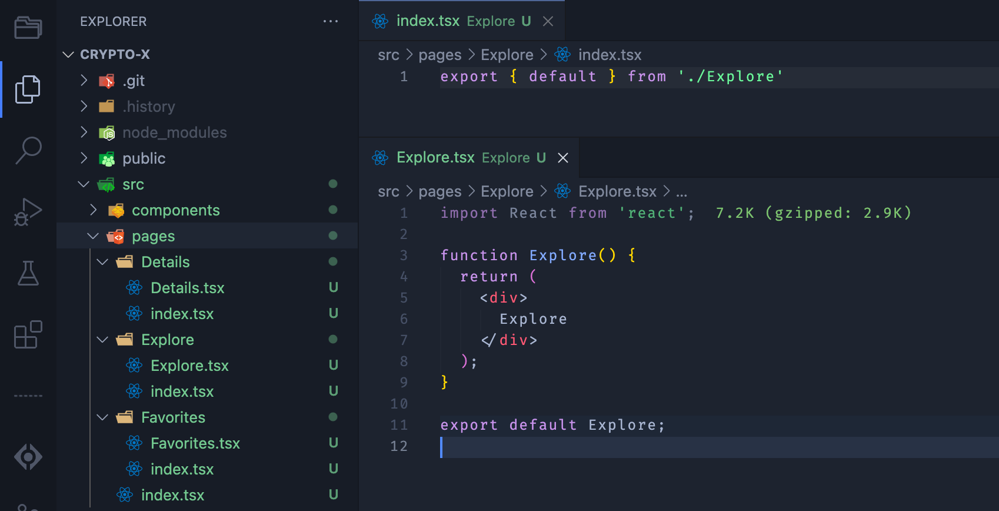

To keep things simple create each page with the basic content, whilst listing the page name, so you can differentiate them.

But first, you want to have common behaviour for the page, such as it filling out the available space, and being able to scroll.

For that you should create a `Page.tsx` component in the `src/components/` folder:
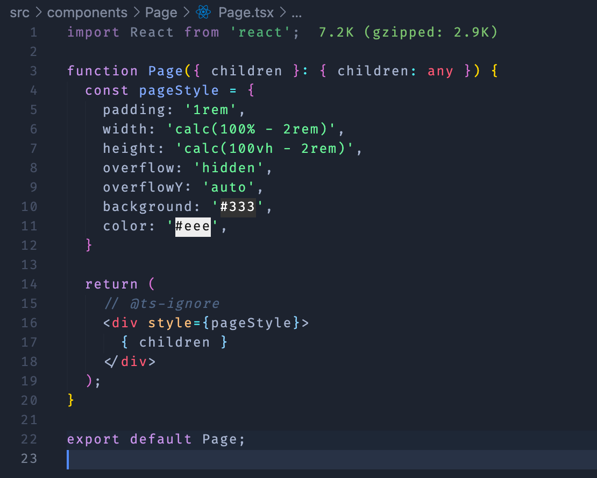

And then wrap each page with the `<Page />` component:
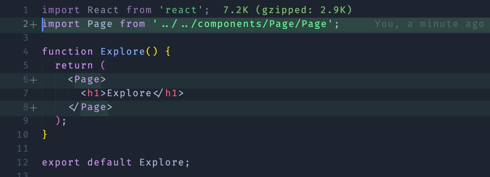

### Routing

For now, this is fine, but we'll need to add a router to navigate between pages. Run the following in your terminal:

```sh
yarn add react-router react-router-dom
```

This updates your `package.json` and `yarn.lock` with the required dependencies from [npmjs.com](http://npmjs.com)

Since we are using [TypeScript](https://www.typescriptlang.org/), you'll also have to add the respective types:

```sh
yarn add @types/react-router @types/react-router-dom
```

> Your `package.json` should have the dependencies added if everything went smoothly.

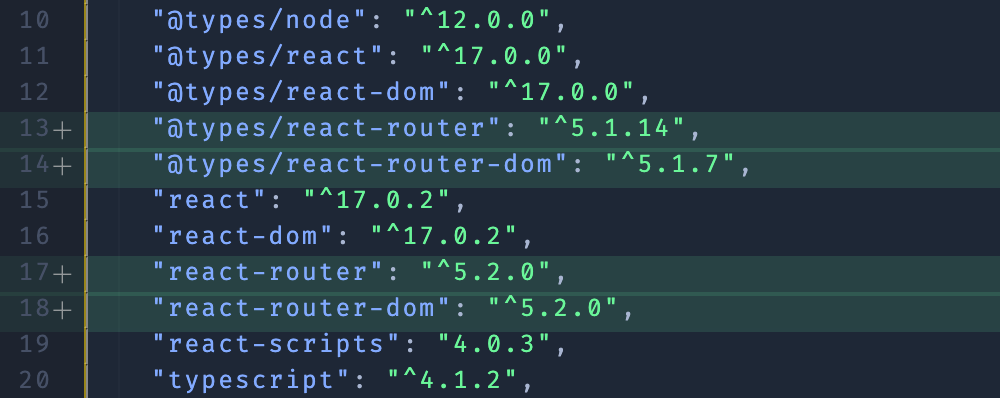

> Next we will modify the App entry point to cater for all the different pages by implementing `react-router`.

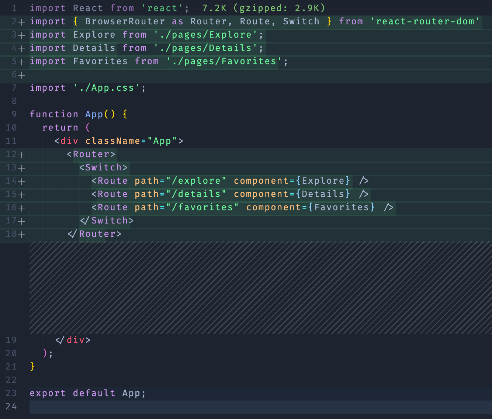

### Navbar

Next we need to add a navbar to have a UI that navigates between pages.

> BONUS: add a responsive UI for this navbar, where it appears as a bottom Tab Navbar (similar to iOS apps) when in Mobile view.

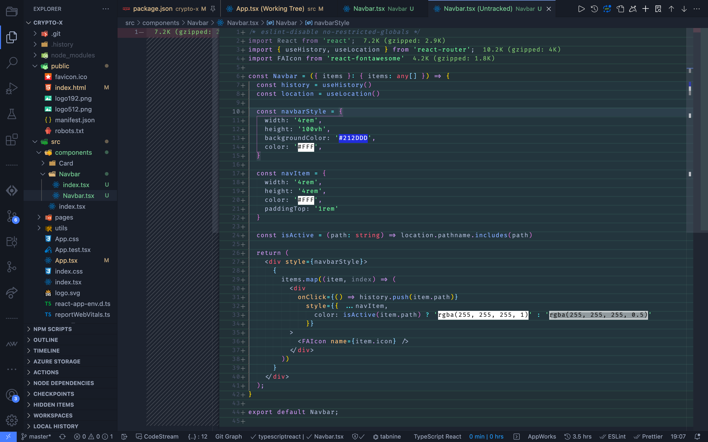

And add it to your `App.tsx` file:
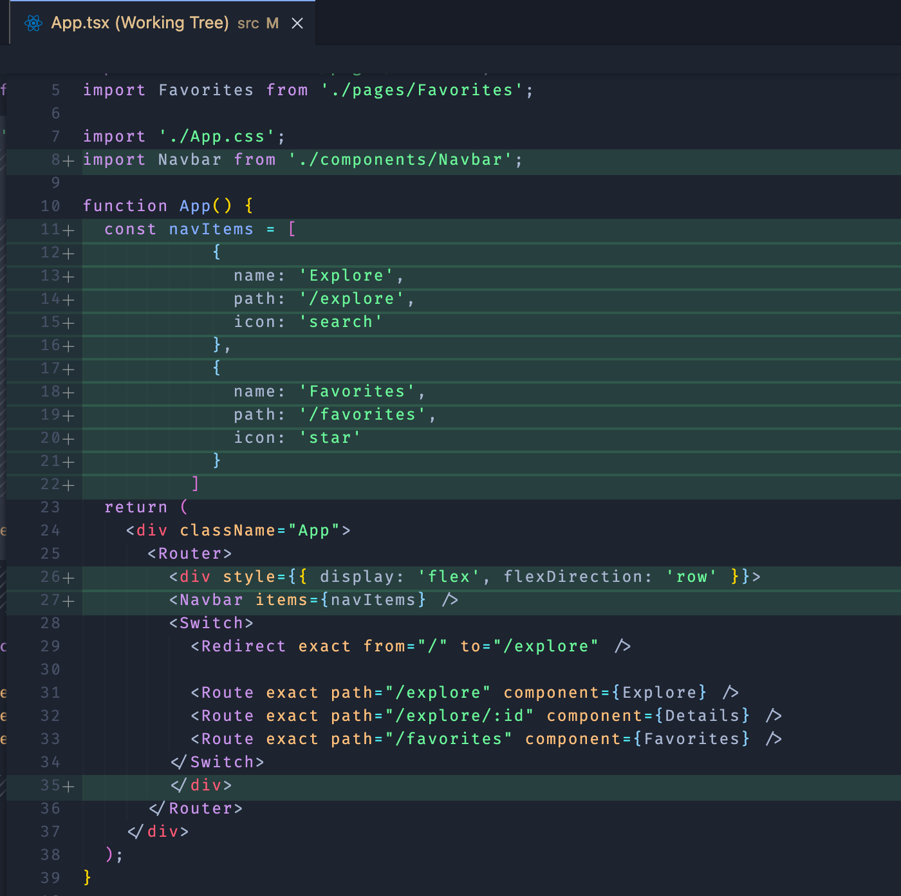

### Connecting to APIs

To connect to backend APIs we will use the library [axios](https://www.npmjs.com/package/axios)

```sh
yarn add axios
```

As mentioned earlier, we will be connecting to CoinGecko to fetch a variety of crypto currency data.

To write clean code, we'll put all the implementation details of the API into a service under `src/services/coingecko.ts`:

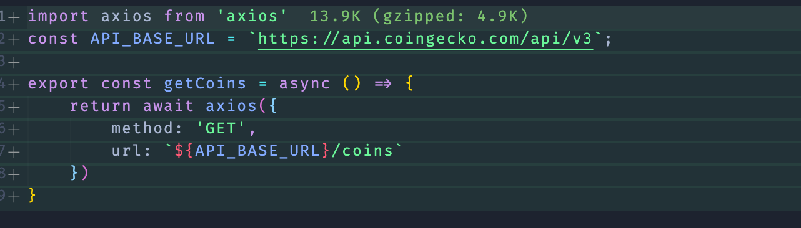

For now we will just be pulling basic data of all coins into the explore page.

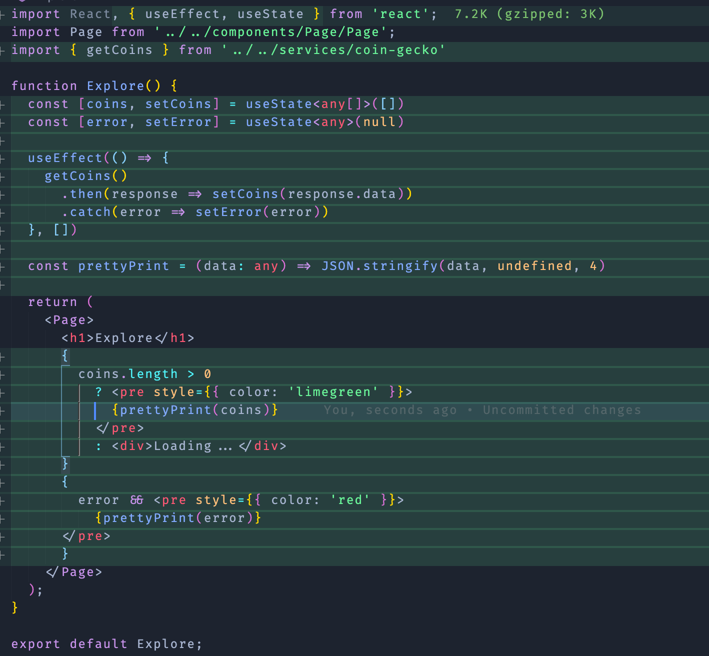

Ideally you should be able to see something like this in your browser window now.

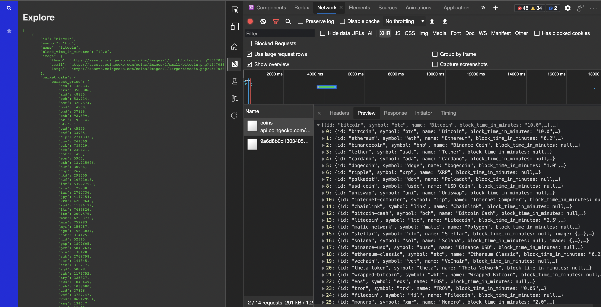

#### Adding an Icon Font

You might wonder how we got those icons into the side bar? Just use an iconfont to make things clean and simple.

- [Why and how to use an icon font?](https://www.google.com/url?sa=t&rct=j&q=&esrc=s&source=web&cd=&ved=2ahUKEwi88MOSg4bxAhVFyqQKHadqApwQtwIwDHoECAIQAw&url=https%3A%2F%2Fvanseodesign.com%2Fweb-design%2Ficon-fonts%2F&usg=AOvVaw20pkUUhWl_HT7khSojuexU)

Choose of the public [FontAwesome CDN urls](https://cdnjs.com/libraries/font-awesome) and add it to the `index.html` in the `<head>` tag.

```html
<head>
  <!-- ... stuff -->
  <link href="https://cdnjs.cloudflare.com/ajax/libs/font-awesome/5.15.3/css/all.min.css" rel="stylesheet">
  <!-- ... more stuff -->
</head>
```

Ideally, install the React wrapper for [FontAwesome](https://fontawesome.com/v5.15/icons?d=gallery&p=2).

```jsx
import FAIcon from 'react-fontawesome'

// usage
<FAIcon name="star" />
```

### Styling

Either style your app to resemble what you saw in the screenshot above, or come up with your own look and feel (or just copy one from somewhere online).

In this section we will be adding TailwindCSS to make it easier to maintain.
